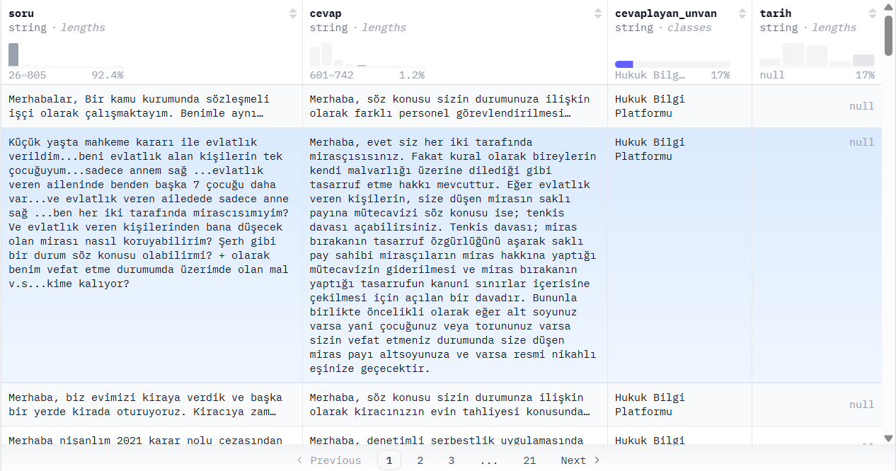
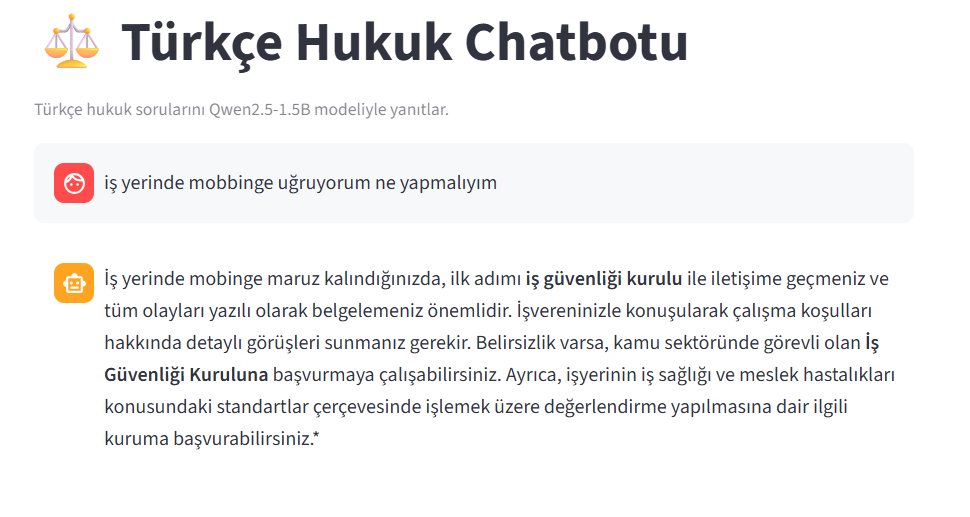
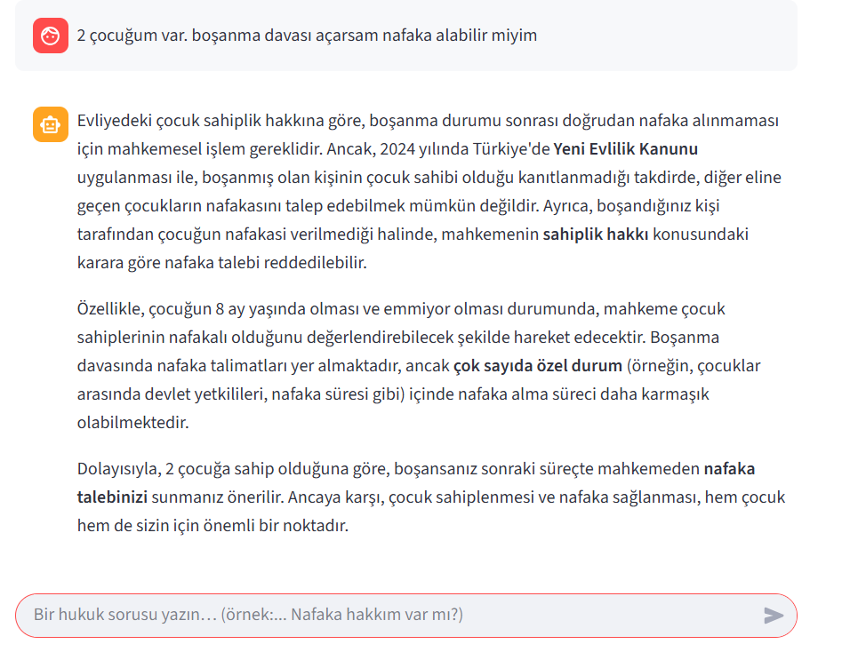

# ⚖️ Türkçe Hukuk Chatbotu

**Retrieval-Augmented Generation (RAG) tabanlı yerel hukuk danışmanı**

---

## 🦩 Proje Amacı

Bu proje, Türk hukuk sistemine ait metinleri (soru–cevap veri seti) kullanarak çalışan bir **hukuk danışmanı chatbotu** geliştirmeyi amaçlamaktadır.  
Kullanıcı, doğal dilde bir Türkçe hukuk sorusu yazdığında sistem:

1. **Hugging Face'teki Türk hukuk veri setinden** ilgili belgeleri vektör benzerliğiyle bulur,  
2. **RAG mimarisi** sayesinde bağlamı Large Language Model'e (LLM) aktarır,  
3. **Qwen modelini** kullanarak kısa, resmi bir Türkçe yanıt üretir.


## 📚 Veri Seti Hakkında

### Kaynak
- **Platform:** Hugging Face Datasets
- **Veri Seti:** [Hugging Face](https://huggingface.co/datasets/alibayram/hukuk_soru_cevap)
- **Dil:** Türkçe
- **Tür:** Soru-Cevap çiftleri
- **Veri Seti Adı:** hukuk_soru_cevap 
- **Kapsam:** 2000+ Türkçe hukuk sorusu ve uzman yanıtı  

### 🔹 Genel Bakış  
Türkçe Hukuki Soru-Cevap Veri Seti, **kghukukankara.com** ve **hukuksorucevap.com.tr** sitelerinden toplanmış hukuki soru–cevap metinlerinden oluşan kapsamlı bir koleksiyondur.  
Bu veri seti, **araştırmacılar, hukuk profesyonelleri ve geliştiriciler** için doğal dil işleme (NLP) projelerinde, özellikle **hukuk alanındaki yapay zekâ uygulamalarında** kullanılmak üzere hazırlanmıştır.

### İşlemler
- Boş değerler temizlendi
- Metinler standartlaştırıldı
- Türkçe karakterler korundu

### 🔹 Örnek Kayıt

Aşağıda veri setinin örnek bir kısmı yer almaktadır 👇




## 🛠️ Teknolojiler

| Katman | Teknoloji | Açıklama |
|--------|------------|-----------|
| **Veri Seti** | `datasets` (HF) | `alibayram/hukuk_soru_cevap` veri setinden 2080 kayıt. |
| **Vektör DB** | `Chroma` | Embedding sonuçlarını saklar ve benzerlik tabanlı arama yapar. |
| **Embedding** | `sentence-transformers/paraphrase-multilingual-MiniLM-L12-v2` | Türkçe destekli çok dilli MiniLM modeli. |
| **LLM (Yanıt Üretici)** | `Qwen/Qwen3-1.7B` | Türkçe dil yeteneği güçlü açık kaynaklı model (CPU üzerinde). |
| **RAG Framework** | `LangChain` | TextSplitter, Retriever ve Embedding yönetimi. |
| **Arayüz** | `Streamlit` | Kullanıcı etkileşimi ve sohbet penceresi tasarımı. |
| **Ortam Yönetimi** | `python-dotenv` | Hugging Face token ve yapılandırmaların .env dosyasından okunması. |


## 🏗️ Mimari

### 🧠 Genel Mimari Akış

1. **Kullanıcı**, Streamlit arayüzünden Türkçe bir hukuk sorusu yazar.  
2. **Retriever**, Chroma vektör veritabanı üzerinden en alakalı 6 belgeyi bulur.  
3. Bu belgeler `build_context()` fonksiyonunda birleştirilerek **bağlam (context)** oluşturulur.  
4. Bağlam ve kullanıcı sorusu birlikte **Qwen3-1.7B** modeline verilir.  
5. Model yanıtı üretir; `<think>` gibi içsel düşünceler regex ile temizlenir.  
6. Sonuç, Streamlit arayüzünde “assistant” mesajı olarak kullanıcıya gösterilir.  

```text
Kullanıcı Sorusu
        │
        ▼
 ┌──────────────────────┐
 │  Chroma Retriever    │
 │ (Embedding Search)   │
 └──────────────────────┘
        │
        ▼
 ┌──────────────────────┐
 │  RAG Pipeline        │
 │ (LangChain + Qwen)   │
 └──────────────────────┘
        │
        ▼
 ┌──────────────────────┐
 │  Türkçe Yanıt Üretimi│
 └──────────────────────┘
        │
        ▼
Streamlit Arayüzü (Chat UI)
```

### ⚙️ RAG Pipeline Mimarisi

Retrieval-Augmented Generation (RAG) yapısı, projenin temelini oluşturur.  
Bu mimari sayesinde sistem, sadece veri setindeki bilgilere dayanarak bağlamlı ve güvenilir Türkçe yanıtlar üretir.

---

### 🔹 1. Veri Hazırlama Katmanı
**Amaç:** Türkçe hukuk veri setini düzenlemek, temizlemek ve vektör aramalarına uygun hale getirmek.

- Hugging Face üzerinden `alibayram/hukuk_soru_cevap` veri seti yüklenir.  
- `load_dataset()` fonksiyonu ile veriler çekilir, `soru` ve `cevap` sütunları normalize edilir.  
- LangChain’in `RecursiveCharacterTextSplitter` sınıfı ile metinler 1200 karakterlik parçalar halinde bölünür.  
- Her belge “Soru: …\n\nCevap: …” formatında hazırlanır ve embedding işlemine aktarılır.

---

### 🔹 2. Retrieval Katmanı
**Amaç:** Kullanıcının sorduğu soruya en uygun bağlamı bulmak.

- **Embedding modeli:** `sentence-transformers/paraphrase-multilingual-MiniLM-L12-v2`  
  - Çok dilli, Türkçe performansı yüksek bir modeldir.  
- **Vektör veritabanı:** `Chroma`  
  - Metin embedding’leri saklar ve benzerlik tabanlı (cosine similarity) arama yapar.  
- **Retriever:**  
  - `vectordb.as_retriever(search_kwargs={"k": 6})`  
  - Kullanıcı sorusuna en yakın **6 belge** geri döndürülür.  
- Bu belgeler `build_context()` fonksiyonu ile birleştirilip model için bağlam oluşturur.

---

### 🔹 3. Generation Katmanı
**Amaç:** RAG’den gelen bağlamı kullanarak nihai Türkçe yanıtı üretmek.

- **Model:** `Qwen/Qwen3-1.7B` (Transformers, PyTorch, CPU)  
- **Tokenizer:** `AutoTokenizer.apply_chat_template()` kullanılarak Qwen formatına uygun mesaj yapısı hazırlanır.  
- **Prompt tasarımı:**  
  - Türkçe yanıt zorlaması (“Cevaplarını her zaman TÜRKÇE olarak ver”)  
  - İçsel düşünce üretimi yasak (“Asla <think> yazma”)  
  - Maksimum 2–3 paragraf uzunluğunda, resmi, kısa ve bağlama sadık yanıtlar.  
- **Üretim parametreleri:**  
  - `temperature = 0.4` → kararlı yanıt  
  - `top_p = 0.9`, `repetition_penalty = 1.2`  
  - `max_new_tokens = 400`  
- **Temizlik:** Regex ile `<think>` bölümleri çıkarılır, sadece nihai yanıt bırakılır.

---

### 🔹 4. Kullanıcı Arayüzü Katmanı
**Amaç:** Kullanıcı ile etkileşimli ve kolay bir sohbet deneyimi sunmak.

- **Arayüz:** Streamlit  
  - `st.chat_input()` ile kullanıcıdan soru alınır.  
  - `st.chat_message("assistant")` ile modelin yanıtı gösterilir.  
- **Özellikler:**
  - Gerçek zamanlı sohbet deneyimi  
  - Mesaj geçmişi (`st.session_state.messages`) saklanır  
  - İlk açılışta dataset ve model `@st.cache_resource` ile yüklenir → hız artışı sağlar  

---

## 🧭 Sonuç

Bu mimari ile:
- Türkçe hukuk alanında, bağlam tabanlı ve güvenilir yanıtlar üretilebilmektedir.  
- RAG yaklaşımı sayesinde **ezber değil, belgeye dayalı cevaplar** sağlanmaktadır.  
- CPU üzerinde çalıştığı için erişilebilirlik yüksek, ancak yanıt süresi görece uzundur.  

### ⚙️ Performans ve Yanıt Süresi

- **Model:** Qwen3-1.7B (CPU, float32)  
- **Yanıt Süresi:** Ortalama **2–3 dakika** arası  
- **Neden:**  
  - Modelin boyutu (1.7B parametre) ve float32 işlem tipi CPU’da yüksek gecikme yaratmaktadır.  
  - RAG pipeline’ında embedding sorgusu + generate işlemi ardışık çalışmaktadır.

**Performans İyileştirme Önerileri:**
- Daha küçük model: `Qwen2.5-0.5B-Instruct` veya `Mistral-7B-Instruct-v0.2` (4-bit quantization).  
- Modeli `torch_dtype=torch.float16` veya `bitsandbytes` 8-bit quantization ile yüklemek.  
- `RETRIEVER_K` değerini 6’dan 4’e düşürmek.  
- `max_new_tokens`’u 250 civarına çekmek.


### 🔹 Örnek Sonuçlar

Aşağıda chatbotun bazı sonuçları yer almaktadır. 👇

| Örnek 1 | Örnek 2 | Örnek 3 |
|:--------:|:--------:|:--------:|
|  |  | 


## 🌐 Demo
**Veri Seti:** [Hugging Face Space linki](https://huggingface.co/spaces/Yarenibis/hukuk_chatbot) 
secret kısmına kendi hugging face token'ınızı yazmayı unutmayın!!!

## 🚀 Kurulum
1. **Repository klonlama**
```bash
git clone <repository-url>
cd turkce-hukuk-chatbot
````
2. **Sanal ortam oluşturma**
```bash
python -m venv venv
source venv/bin/activate  # Linux/Mac
venv\Scripts\activate    # Windows
````
3. **Paketleri yükleme**
```bash
pip install -r requirements.txt
````
4. **Uygulamayı çalıştır**
```bash
streamlit run app.py

